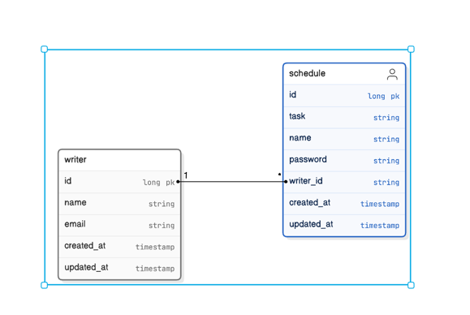

# 일정 관리 앱 서버 

## 개발 전, 공통 조건
- [ ] 일정 작성, 수정, 조회 시 반환 받은 일정 정보에 `비밀번호`는 제외해야 합니다.
- [ ] 일정 수정, 삭제 시 선택한 일정의 `비밀번호`와 요청할 때 함께 보낸 `비밀번호`가 일치할 경우에만 가능합니다.
    - [ ] 비밀번호가 일치하지 않을 경우 적절한 오류 코드 및 메세지를 반환해야 합니다.
- [ ] `3 Layer Architecture` 에 따라 각 Layer의 목적에 맞게 개발해야 합니다.
- [ ] CRUD 필수 기능은 모두 데이터베이스 연결 및 `JDBC` 를 사용해서 개발해야 합니다.

# API 명세서

## 책 등록

| 메소드 | URL       | 요청 Body                                                                                        | 응답 코드       | 설명    |
|--------|-----------|------------------------------------------------------------------------------------------------|-------------|-------|
| POST   | /schedule | `{ "task": "할일", "name": "작성자명", "password": "비밀번호", "createdAt": "작성일", "updatedAt": "수정일" }` | 201 Created | 일정 생성 |

## 책 조회

| 메소드 | URL                | 요청 Param              | 응답 Body                                                                                              | 응답 코드 | 설명               |
|--------|--------------------|-----------------------|------------------------------------------------------------------------------------------------------|-----------|------------------|
| GET    | /read/{scheduleId} | `scheduleId` (스케줄 ID) | `{"task": "할일", "name": "작성자명", "createdAt": "작성일", "updatedAt": "수정일"}` | 200 OK    | 특정 일정 정보를 조회합니다. |

## 책 전체 조회

| 메소드 | URL             | 요청 Param                                                         | 응답 Body                                                                           | 응답 코드 | 설명                   |
|--------|-----------------|------------------------------------------------------------------|-----------------------------------------------------------------------------------|-----------|------------------------|
| GET    | /read/schedules | `startDate` (조회 수정일 시작 기회), `endDate` (조회 수정일 끝 기간) `name` (작성자) | `[ {"task": "할일", "name": "작성자명", "createdAt": "작성일", "updatedAt": "수정일"}, ... ]` | 200 OK    | 책 목록을 조회합니다.    |

# ERD

